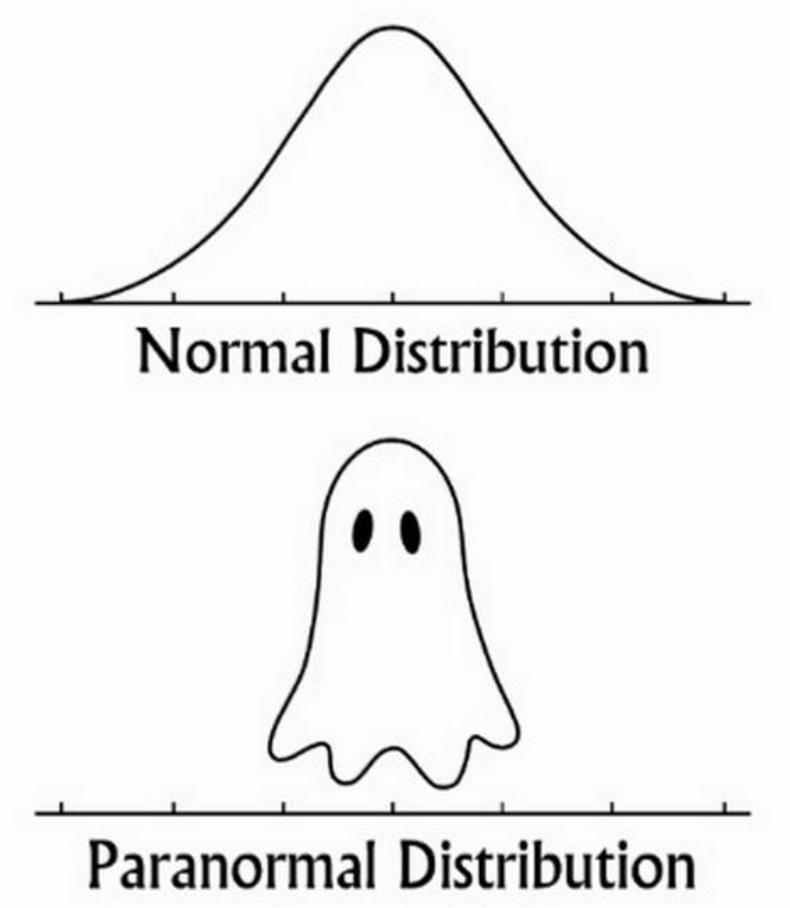

```{r setup, include=FALSE}
knitr::opts_chunk$set(echo = TRUE)
```

(Generate this document using R Markdown.)

# 1 R Markdown {-}
This is my first R Markdown document. Markdown is a simple formatting syntax for authoring HTML, PDF, and MS Word documents. For more details on using R Markdown see http://rmarkdown.rstudio.com.

## 1.1 Mathematical expressions {-}
I write the root formula for quadratic equation $ax^2+bx+c=0$ as
$$x=\frac{-b\pm\sqrt{b^2-4ac}}{2a}.$$

## 1.2 Figures {-}
I will embed two plots using `pressure`(Vapor Pressure of Mercury as a Function of Temperature) and `Nile` (Flow of the River Nile) datasets in the R library:
```{r pressure}
pressure
```
```{r Nile}
Nile
```
I can arrange the plot of ‘pressure’ and the histogram of ‘Nile’ side-by-side:
```{r, fig.show='hold', out.width='50%'}
plot(pressure,main="Pressure")
hist(Nile)
```

## 1.3 Tables {-}
Here is a table that includes `HairEyeColor` dataset:
```{r}
knitr::kable(
  HairEyeColor, caption = 'Hair and Eye Color of Statistics Students.'
)
```

## 1.4 Links {-}

Finally, I include one (whatever) funny graphic that links to a website:
``` {r, out.width='200', fig.align='left', echo=FALSE}
      
```

The reason I like this figure is:

- Normal (Gaussian) distribution graph information
- Similarity
  + Silly
  + Funny
   
# !!! THE END !!!
